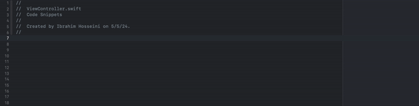

<div align="center" id="top"> 
  

  &#xa0;
</div>

<h1 align="center">Live Xcode Code Snippts</h1>

## :dart: About

***Sync Your Xcode Code Snippets Across Devices with One Drive.***

## :sparkles: Features

- [x] Coding Fast.
- [x] Access to code snippets across all devices.
- [x] Access to every code part by shortcut.

<!-- ## :rocket: Technologies ##

The following tools were used in this project:

-  -->

## :white_check_mark: Requirements

Before starting :checkered_flag:, you need to have [Xcode](https://apps.apple.com/us/app/xcode/id497799835?mt=12) and [One Drive](https://apps.apple.com/us/app/onedrive/id823766827?mt=12) installed.

## :checkered_flag: Starting

```bash
# Clone this project
$ cd Downloads
$ git clone https://github.com/IbrahimHosseini/swift-CodeSnippets.git

# Access
$ cd swift-CodeSnippets

# Move the folder to your cloud storage (one drive or other cloud storage)
$ mv -v /Users/YOUR_USERNAME/Downloads/swift-CodeSnippets/CodeSnippets ~/Users/YOUR_USERNAME/Library/CloudStorage/OneDrive-Personal/Documents/CodeSnippets

# Link cloud code snippets to your Xcode code snippets
$ ln -s ~/Users/YOUR_USERNAME/Library/CloudStorage/OneDrive-Personal/Documents/CodeSnippets /Users/YOUR_USERNAME/Library/Developer/Xcode/UserData/

# replacing YOUR_USERNAME.
```

## :memo: License

This project is under license from MIT. For more details, see the [LICENSE](LICENSE) file.


Made with :heart: by <a href="https://github.com/ibrahimhosseini" target="_blank">Ibrahim</a>

&#xa0;

<a href="#top">Back to top</a>
